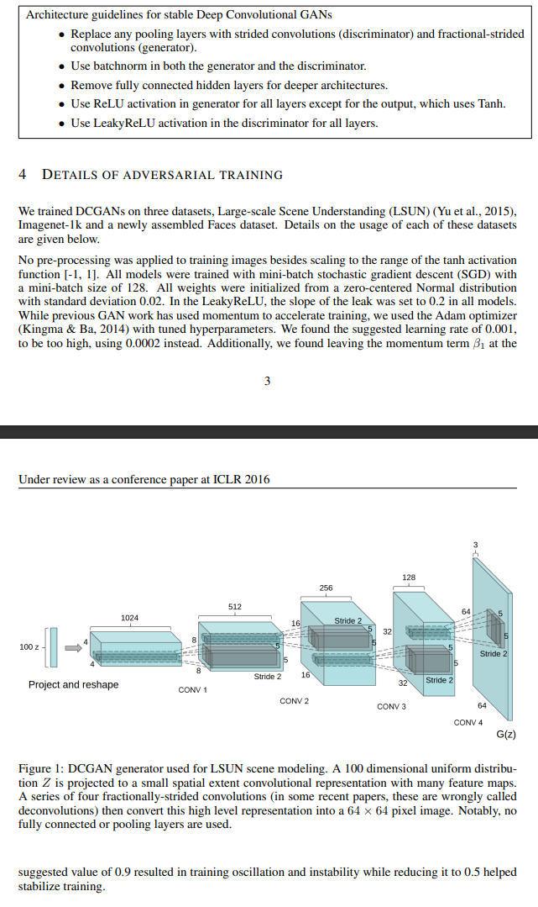

# ECE176 Final Project: GAN Image Model
## Younus Ahmad and Ali Hussain

### COMPLETED ✅

- Initial architecture of generator and discriminator
- Single-class GAN model (trained only on buildings from Nature Dataset)

### TO-DO (MAY NOT BE COMPLETE) 📋

- Weight Initialization for Generator and Discriminator
- Resolve blurry generated image. Possible solutions:
    - Modify architecture
    - Modify hyperparameters
    - Modify training process
    - Image Resolution?
    - Try evaluating performance on different datasets first

- Try multi-class GAN models.

</ul>

### WORK-IN-PROGRESS ✍️

- There is some starter code (taken from DCGAN tutorial) for:
    - weight initialization
    - training
    - plotting loss vs iterations

- This code will have to be written from scratch and modified as it generates blurry images.

### USEFUL INFORMATION 
Output size from `nn.ConvTranspose2d` (assuming H = W):
    $$Out = (In - 1) \times S - 2 \times P + kernelSize + outputPadding $$

Output size from `nn.Conv2d` (assuming H = W):
    $$Out = \lfloor\frac{In + 2 \times padding - kernelSize}{stride}\rfloor$$

DCGAN Architecture and Hyperparameters:  

### RESOURCES 💻
<ul>
<li> Papers/Tutorials: 

- [DCGAN Paper](https://arxiv.org/pdf/1511.06434.pdf)
- [DCGAN PyTorch Tutorial](https://pytorch.org/tutorials/beginner/dcgan_faces_tutorial.html)

 

<li> Datasets:  

- [Nature](https://www.kaggle.com/code/nageshsingh/nature-image-classification)
- [Sports](https://www.kaggle.com/datasets/puneet6060/intel-image-classification?resource=download)

</ul>

### HOW TO RUN CODE

- To install requirements:  
&nbsp;&nbsp;&nbsp;`pip install -r requirements.txt`

- Store a single class subfolder in a folder named seg_train. For example:  
&nbsp;&nbsp;&nbsp;`seg_train/buildings`  
- Run code cells in main.ipynb.

