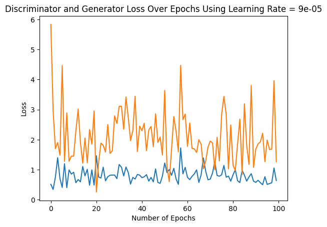
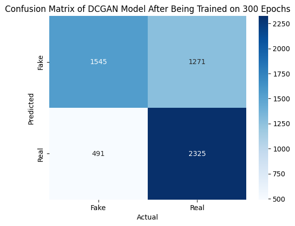
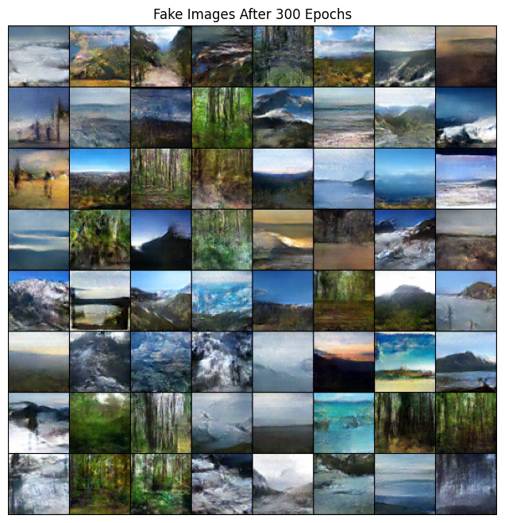

# ECE176 Final Project: GAN Image Model
## Team
- <b> Ali Hussain (ECE) </b>
- <b> Younus Ahmad (ECE) </b>

## 🧠 Overview
This project implements a Deep Convolutional GAN (DCGAN) to generate images from random noise vectors. The generator learns to map latent vectors into realistic images, while the discriminator tries to distinguish real images from those generated by the model.

## 📚 Reference Paper 
DCGAN Paper: [Goodfellow et al.](https://arxiv.org/pdf/1511.06434.pdf)

## 📁 Dataset 
Dataset: [nageshsingh/nature-image-classification](https://www.kaggle.com/code/nageshsingh/nature-image-classification)

## 🧠 Model Architecture

## 🛠️ Training Procedure

| **Hyperparameter**      | **Value**                       |
|-------------------------|---------------------------------|
| Number of Epochs        | 10, 50, 100, 200, 300           |
| Batch Size              | 128                             |
| Optimizer               | Adam                            |
| Learning Rate           | 0.00009 (best), 0.0002 (baseline), 0.0006, 0.0009 |
| Loss Function           | Binary Cross-Entropy (BCE)      |
| Latent Dimension (z)    | 100                             |
| Kernel Sizes Tested     | 3, 5 (default), 7               |
| Padding Values          | 1 (for k=3), 2 (for k=5), 3 (for k=7) |
| Activation (Generator)  | ReLU (hidden), Tanh (output)    |
| Activation (Discriminator) | LeakyReLU (slope=0.2)        |
| Normalization           | BatchNorm (all layers except final) |

## 📊 Results

### Loss Curve

### Confusion Matrix

### Generated Images

